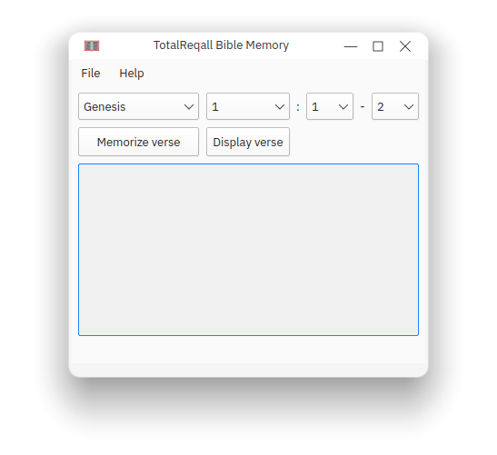
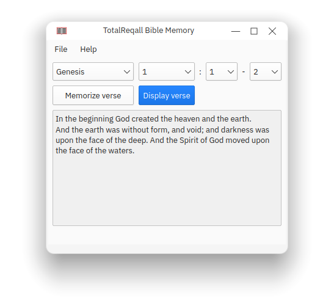
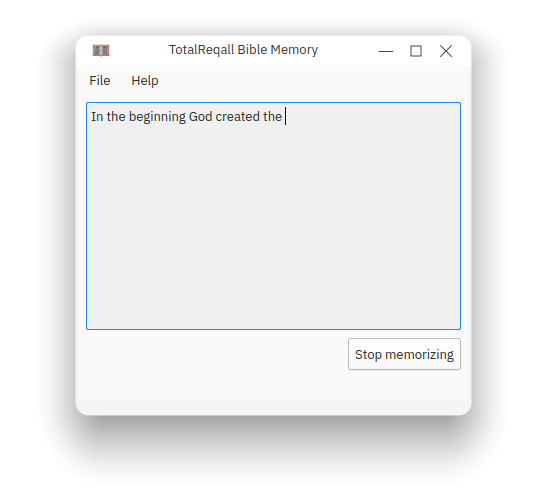
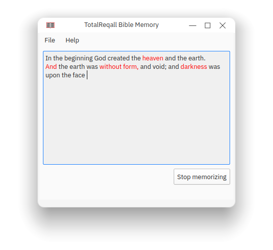
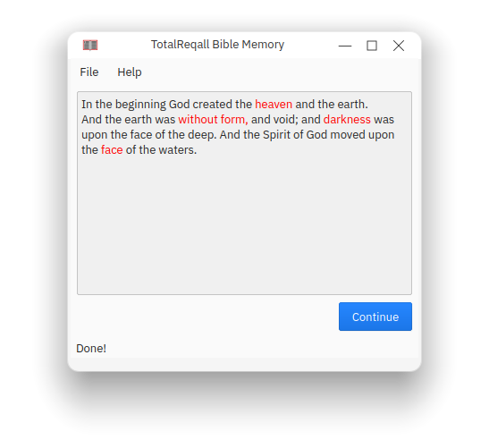
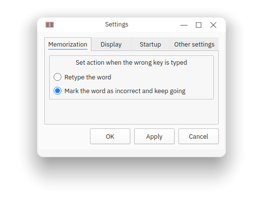
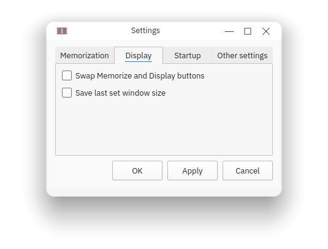
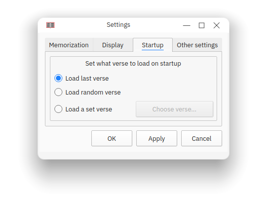
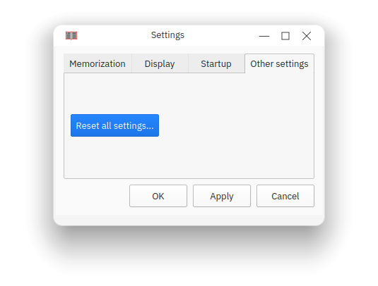

# TotalReqall

TotalReqall is a program designed to help you memorize things. Currently, TotalReqall only supports memorizing Bible verses in the King James Version, although support for adding custom content such as poetry is planned.

TotalReqall is known to work on Linux and Windows, although it should work on any system that supports Qt and the C++ STL.

## Screenshots
        

## Downloads
Currently there is no system in place for uploading binaries.

## Getting TotalReqall
To run this program, install Qt Creator, clone this repo, run `git submodule init` and `git submodule update` in the cloned directory, open TotalReqall.pro in Qt Creator, and build the program.